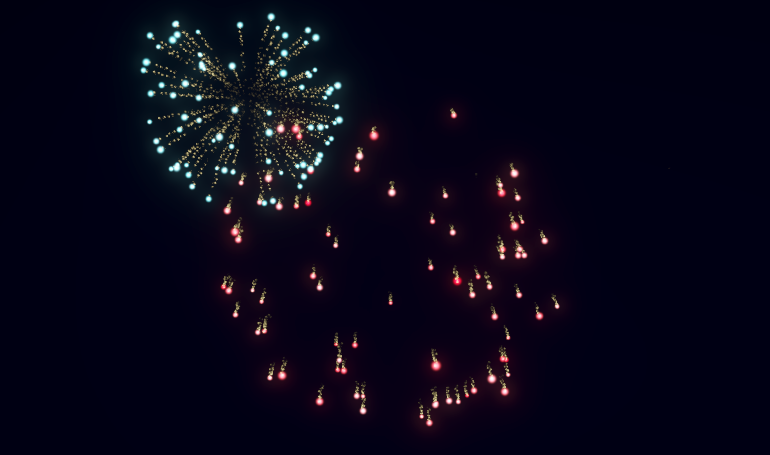
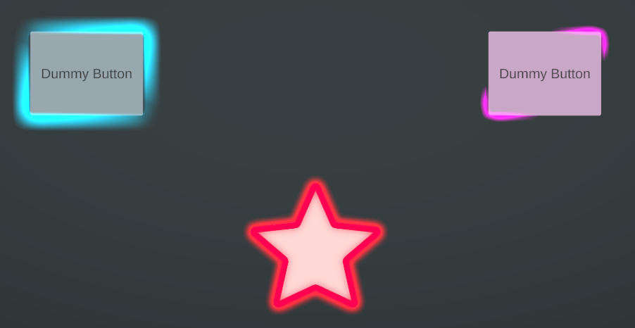
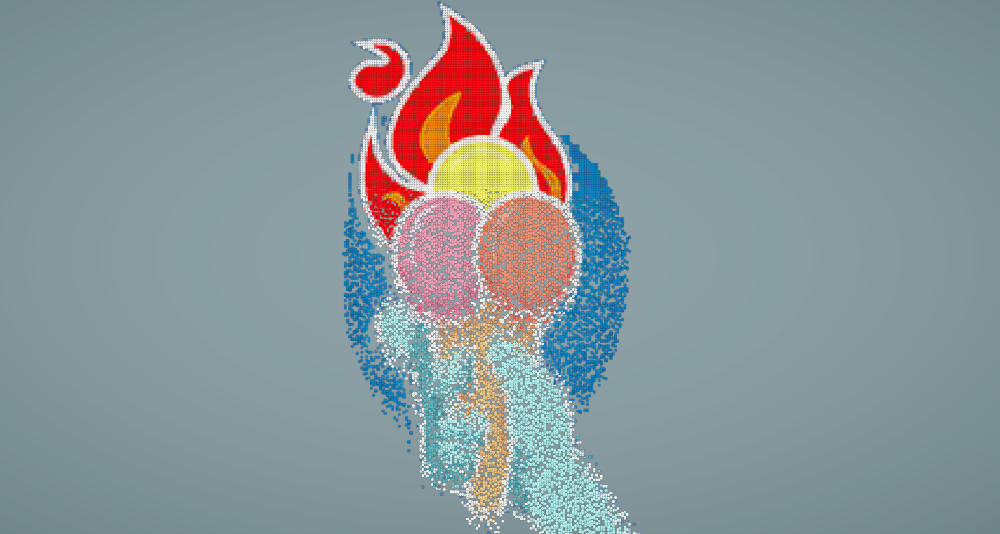

# Unity VFX Graph Examples

According to the [documentation]( https://docs.unity3d.com/Packages/com.unity.visualeffectgraph@17.0/manual/index.html) the Visual Effect Graph enables you to author visual effects using Node-based visual logic. This repository provides examples for some specific cases in VFX Graph such as Point Caches, SDFs and VFX on UI.

## Examples Cases

**GPU Events:** This case provides an example to show how to spawn particles based on other particles by using GPU Events. It creates a basic firework VFX.
  

**Flip Book on UI:** Basics of flip book playback and how to play them on the UI.
  

**Point Cache:** This case includes basics of Point Caches in VFX Graph. Also, it includes a C# script to control VFX Graphs and set their properties via C# API.

**Point Cache on UI:** This case provides an example to show how to play VFXs on UI by using a custom Sprite Unlit Shader Graph for UI.
  

**Signed Distance Field (SDF):** Basics of SDFs and how to use them in VFX Graphs. Also, it uses VFX Property Binder Component to set VFX properties at runtime without using C# API.
  

**Custom HLSL Nodes:** This case demonstrates how to inject custom HLSL codes to VFX Graph Blocks and Operators.It breaks the limitations of the built-in nodes and gives more flexibility and control on the graph.

## VFX Graph vs. Particle System

In terms of creativity and product quality VFX Graph is a better option, because it allows the ability of creating more complex visual effects. Graph based creation process is easier to use, especially for complex effects.

On the other hand, in terms of performance, this versus is complicated. Both render particles on GPU, obviously. However, for simulating particles (calculating particle positions, velocities, sizes, etc.) they use different hardware, Particle System uses CPU and VFX Graph uses GPU via compute shaders. So, if you have enough GPU power, using VFX Graph is a better option, because GPU can simulate more particles. However, if you are already bounded by the GPU, then Particle System might be a better option, because it needs less GPU power. 
